# Course 3 Project

> Adapted from the [Istio Quick Start](https://istio.io/docs/setup/kubernetes/quick-start/)

## 1 Container

### 1.1 The app is containerized
There is a Dockerfile in the repo and the docker image can be built:
- [Feed](./udacity-c3-restapi-feed/Dockerfile)
- [User](./udacity-c3-restapi-user/Dockerfile)
- [Frontend](./udacity-c3-frontend/Dockerfile)

### 1.2 The project has public docker images

On DockerHub images for the application are available
- [Feed](https://hub.docker.com/repository/docker/selmy/udacity-restapi-feed)
- [User](https://hub.docker.com/repository/docker/selmy/udacity-restapi-user)
- [Frontend](https://hub.docker.com/repository/docker/selmy/udacity-frontend)
- [Reverse server](https://hub.docker.com/repository/docker/selmy/reverseproxy)

### 1.3 The applications run in a container without errors

Starting the app as a container on a local system

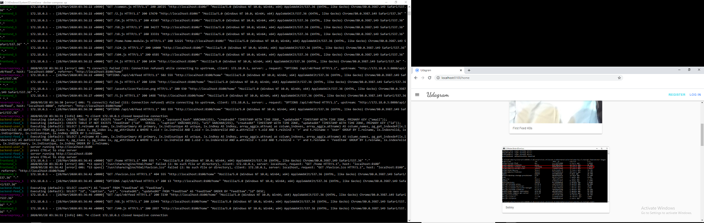

On the right is the docker-compose app is running in cmd and on the left is the frontend application that succesfully retrived all feed and downloaded images.

## 2 CI/CD, Github & Code Quality

### 2.1 The project demonstrates an understanding of CI and Github
Travis CI is integrated to the repo.
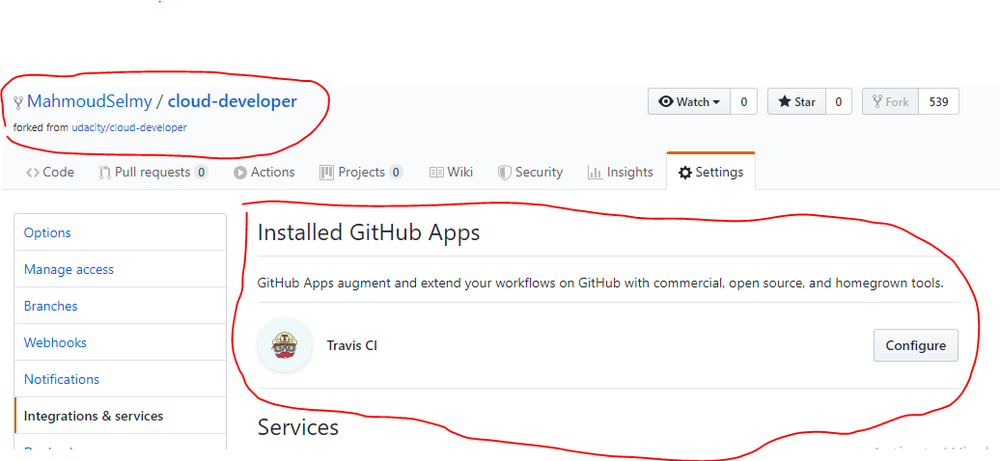

### 2.2 The project uses continuous deployments (CD)
Travis CI trigger is attached to master branch and it build successfully.
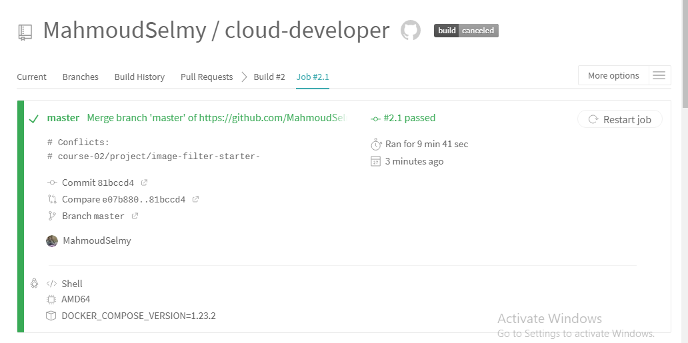

## 3 Deployment

### 3.1 The application runs on a cluster in the cloud: 
The project can be deployed to a Kubernetes cluster.
I have preferred to run my cluster locally as i wanted to make my focus on how to configure the cluster itself.

I won't explain how to run it as it was already explained in the videos, it will be enough to show that everything is rp and running.

- These are the running pods.
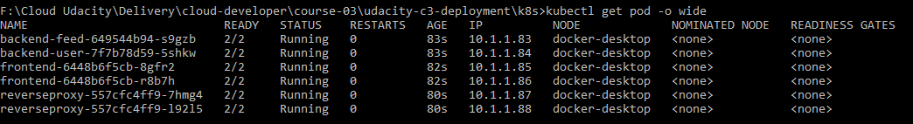
- Application after applying all services and deployments
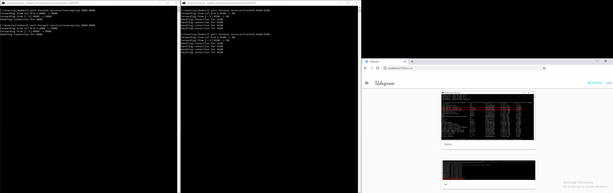

### 3.2 The app can be upgraded via rolling-update
- Create new deployment version of reverseproxy server [reverseproxy-deployment-v2.yaml](./udacity-c3-deployment/k8s/reverseproxy-deployment-v2.yaml)
- Apply the new deployment version and check that the old replica set is still existing.
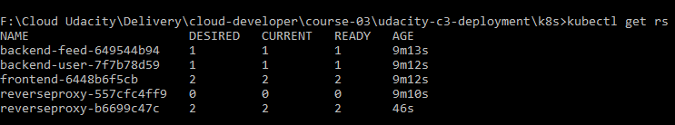

### 3.3 A/B deployment of the application

Two versions - 'Frontend Latest' and 'Frontend V2' are running imultaneously and serve the traffic with configurable weights.

I will use istio to control the traffic.

#### Configuration Steps

- Change the working directory to [ab-deployment](./udacity-c3-deployment/k8s/istio/all-ab-deployment).

- Install custom resource definitions ([istio-crds.yaml](./udacity-c3-deployment/k8s/istio/all-ab-deployment/istio-crds.yaml)):

```
kubectl apply -f istio-crds.yaml
```

- Install demo configuration ([istio-demo.yaml](./udacity-c3-deployment/k8s/istio/all-ab-deployment/istio-demo.yaml)):

```
kubectl apply -f istio-demo.yaml
```
- Configure default namespance:
```
kubectl label namespace default istio-injection=enabled
```
- Enable port 8100:
```
kubectl edit svc istio-ingressgateway -n istio-system
```
```
Add these line to the below file:
  - name: http3
    nodePort: 30001
    port: 8100
    protocol: TCP
    targetPort: 8100
```
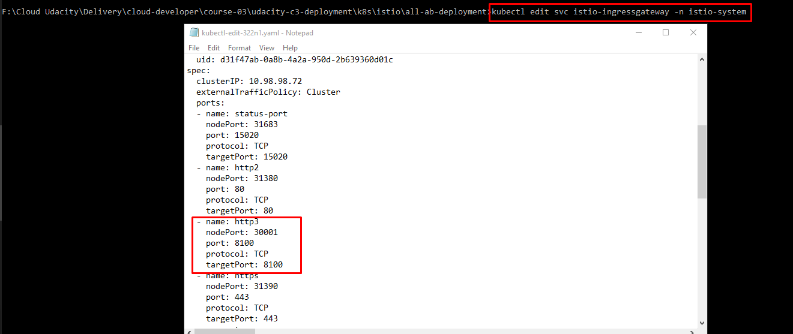

- Configure secrets and configmaps:
```
kubectl apply -f aws-secret.yaml

kubectl apply -f env-configmap.yaml

kubectl create secret generic env-secret --from-literal=POSTGRESS_USERNAME=MY_DB --from-literal=POSTGRESS_PASSWORD=MY_DB
```

- Configure feed, user and reverseproxy server:

Note : all the below deployments has disabled istio injection
```
kubectl apply -f backend-feed-deployment.yaml
kubectl apply -f backend-feed-service.yaml

kubectl apply -f backend-user-deployment.yaml
kubectl apply -f backend-user-service.yaml

kubectl apply -f reverseproxy-deployment.yaml
kubectl apply -f reverseproxy-service.yaml
```
- Configure frontend:
```
kubectl apply -f frontend-deployment.yaml
kubectl apply -f frontend-service.yaml

kubectl apply -f frontend-deployment-v2.yaml
kubectl apply -f frontend-service-v2.yaml

kubectl apply -f frontend-gateway.yaml
kubectl apply -f frontend-virtualservice.yaml
```

- Check pods state:
```
kubectl get pod -o wide
```
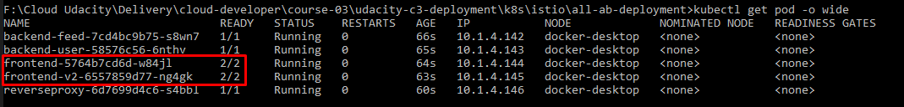

As you can see all pods are up and running and front end pods has neen injected by istio.
# 

#### Running Application Steps

- Forward port 8080 of the reverseproxy server
```
kubectl port-forward service/reverseproxy 8080:8080
```

- Configure frontend service to give version higher weight to version 1 (60% V1 / 40% V2):

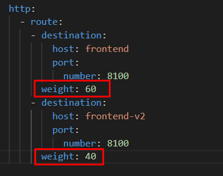
```
kubectl apply -f frontend-virtualservice.yaml
```
Version 1 is shown as expected.

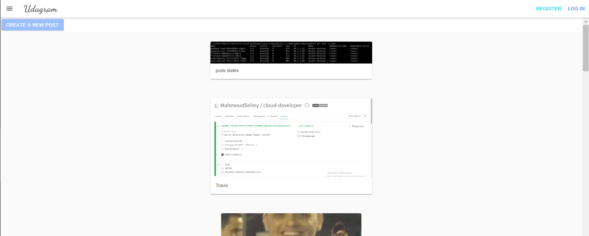

- Configure frontend service to give version higher weight to version 2 (40% V1 / 60% V2):

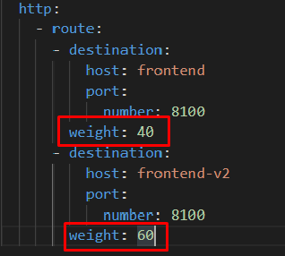
```
kubectl apply -f frontend-virtualservice.yaml
```
Version 2 is shown as expected.

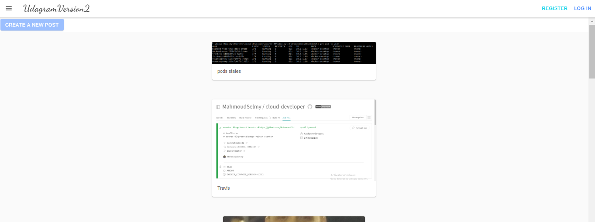