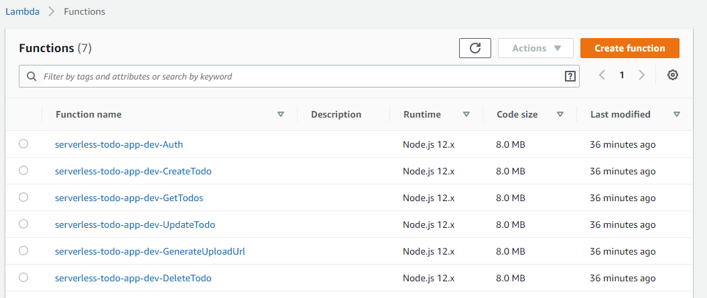
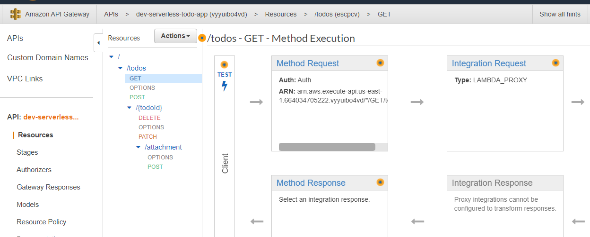
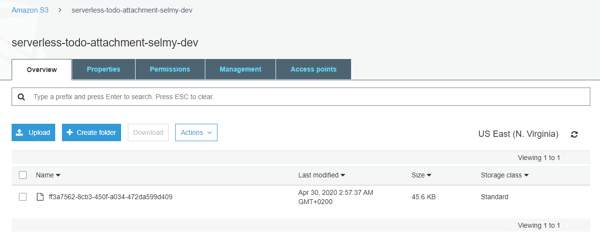
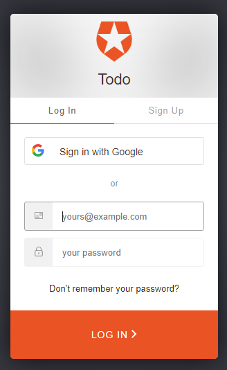
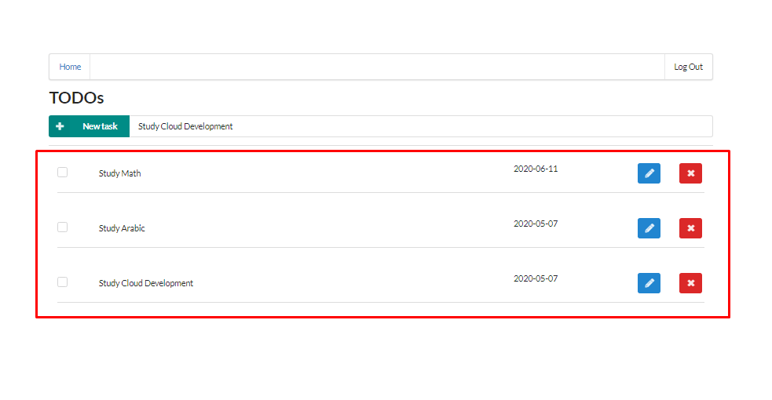
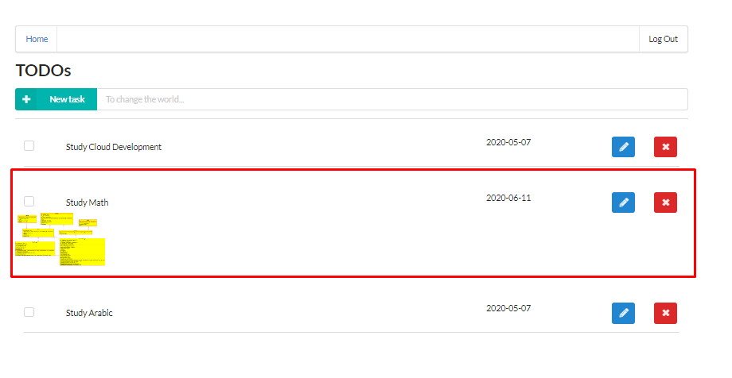
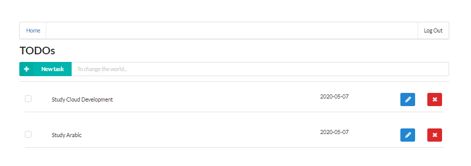

# TODO Serverless Application

> # 1) Backend:
>> ## Lambda functions
>> 
>> ## API Gateway
>> 
>> ## S3 Bucket
>> 
> # 2) Frontend
>> ## Login
>> 
>> ## Get current user's todos
>> 
>> ## Add attachment
>> 
>> ## Update
>> 
>> ## Delete
>> 